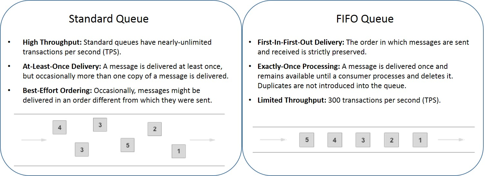
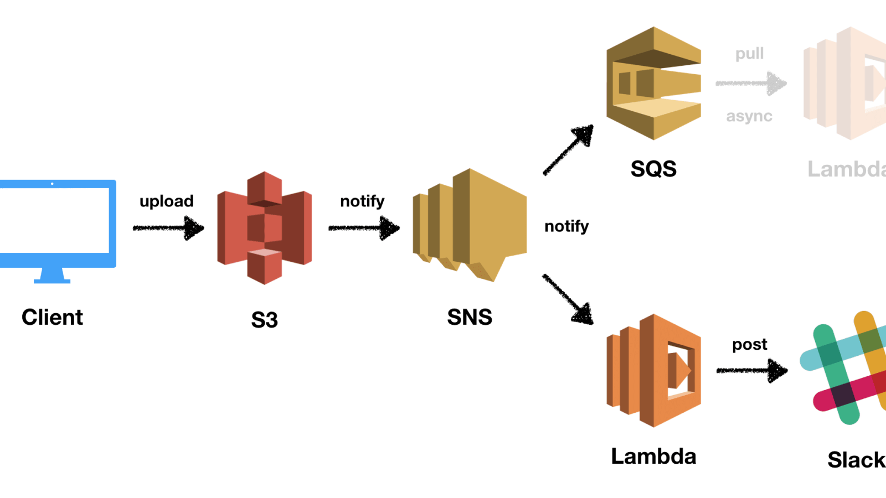
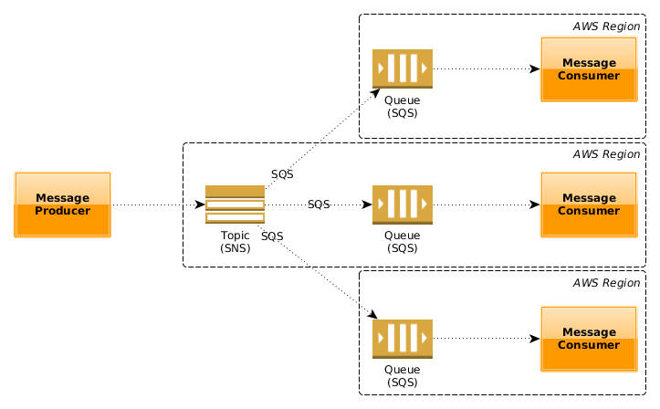

# AWS: Events

### 1. Describe the similarities between AWS API Gateway + Lambda functions and an ExpressJS Server.

* Key Authentication	 
* HTTPS
* CORS
* oAuth2
* Finegrain Access Control
* Rate Limiting

* ExpressJS Server can sit at the heart of any microservices architecture, regardless of what language or platform you’re using. Express Gateway secures your microservices and exposes them through APIs using Node.js, ExpressJS and Express middleware.
* AWS API Gateway a fully managed service that makes it easy for developers to create, publish, maintain, monitor, and secure APIs at any scale.

### 2. List the AWS Database offerings and talk about the pros and cons of each.
- Relational:
Traditional applications, ERP, CRM, e-commerce

    - Key-value:
High-traffic web apps, e-commerce systems, gaming applications
    - In-memory
Caching, session management, gaming leaderboards, geospatial applications
    - Document
Content management, catalogs, user profiles
    - Wide column
High scale industrial apps for equipment maintenance, fleet management, and route optimization

    - Graph
Fraud detection, social networking, recommendation engines
    - Time series
IoT applications, DevOps, industrial telemetry
    - Ledger
Systems of record, supply chain, registrations, banking transactions

 

### 3. What’s the difference between a FIFO and a standard queue?
- Standard queues guarantee that a message is delivered at least once and duplicates can be introduced into the queue. 
- FIFO queues ensure a message is delivered exactly once and remains available until a consumer processes and deletes it; duplicates are not introduced into the queue.

### 4. How can the server be assured a message was properly received?

By having the client emit a 'received' event back to the server upon receipt of the message.
***

## Vocabulary Terms: 

* Serverless API :
  * using API Gateway you can create RESTful APIs that enable real-time two-way communication applications, API Gateway supports containerzied and serverless workloads as well as web applications.
* Triggers :
   * an AWS Lambda resource or resource in another service that you configure to invoke your function in response to lifecycle events, external requests or on a schedule, a function can have multiple triggers.
* Dynamo vs Mongo :
   * Mongo can be deployed anywhere, Dynamo is only available on AWS
Mongo is JSON based document store, Dynamo is limited key-value store with JSON support
Mongo is rich query language, Dynamo is key-value queries.
* Dynamoose vs Mongoose:
  * Dynamoose is a DynamoDB API structured like Mongoose, lets us provide a schema and perform CRUD operations against a DynamoDB table, installed via node and configured based on role.

***

## Preparation Materials
SQS - Simple queue service
Distributed queuing system
Messages are not pushed to receivers, receivers have to poll SQS to receive messages
Messages can’t be received by multiple receivers at the same time
Any one receiver can receive a message, process and delete it, other receivers do not receive the same message later
Mainly used to decouple applications or integrate applications
Messages can be stored in SQS for short duration of time (max 14 days)
SNS - Simple notification service
Fast, flexible and fully managed push notification service that lets you send individual messages or bulk messages
Distributed publish/subscribe system
Messages are pushed to subscribers as and when they are sent by publishers to SNS
SNS supports several end points such as email, sms, http end point and SQS
If you want unknown number and type of subscribers to receive messages, you need SNS.

***
#### Resources: 
* [SNS Javascript SDK](https://docs.aws.amazon.com/AWSJavaScriptSDK/latest/AWS/SNS.html)
* [SQS Javascript SDK](https://docs.aws.amazon.com/AWSJavaScriptSDK/latest/AWS/SQS.html)
* [Databases on AWS](https://aws.amazon.com/products/databases/)

[<=Back](https://github.com/En-ZUH/Reading-notes/tree/main/401)
